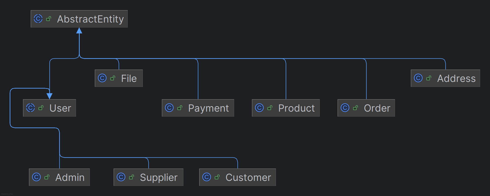

# 🛒 Simple E-Commerce System

A simple, scalable e-commerce backend application built with **Java 21** and **Spring Boot**, designed for learning and practicing enterprise-grade architecture and development.

## 📌 Features

### 👥 User Management
- Register/Login with JWT-based authentication
- Roles: `CUSTOMER`, `SUPPLIER`, `ADMIN`
- User profile management

### 🛍️ Product Management
- CRUD for products (Admin/Supplier only)
- Search, filter, pagination
- Category and stock tracking

### 🛒 Cart & Orders
- Add/remove items from cart
- Checkout and place orders
- Order history and status tracking (`PENDING`, `PAID`, `SHIPPED`, `DELIVERED`)

### 📦 Supplier Management
- Supplier registration & login
- Manage own product listings
- View orders involving their products

### 🔐 Security
- Spring Security with JWT
- Role-based access control
- Password hashing with BCrypt

---

## 🧱 Architecture

The project follows a **Layered Architecture** pattern with clear separation of concerns:

- **Controller Layer**: Handles HTTP requests and maps them to services.
- **Service Layer**: Contains business logic and orchestrates operations.
- **Repository Layer**: Handles data persistence via Spring Data JPA.
- **Domain Layer**: Contains core entities and business rules.

---

## 🧰 Tech Stack

| Layer         | Technology              |
|---------------|-------------------------|
| Language      | Java 21                 |
| Framework     | Spring Boot 3.x         |
| Security      | Spring Security, JWT    |
| ORM           | Spring Data JPA         |
| Database      | H2                      |
| API Docs      | Swagger/OpenAPI         |
| Testing       | JUnit 5, Mockito        |
| Build Tool    | Gradle                  |
| Container     | Docker                  |
| Dev Tools     | Spring DevTools, Lombok |

---

## 🧪 Postman Collection

You can find a Postman collection for testing the API in the [`postman/`](docs/postman) directory at the root of the project.

### 📥 How to Use:
1. Open Postman.
2. Import the collection file from `postman/ecommerce.postman_collection.json`.
3. Make sure your local server is running (e.g., `http://localhost:8080`).
4. Use the requests included in the collection to test available endpoints.

This is helpful for quickly exploring and validating the API without writing manual curl requests.
